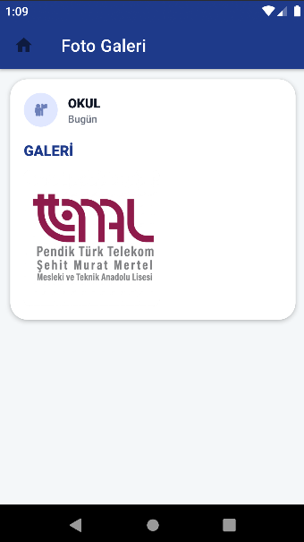
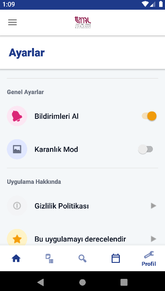
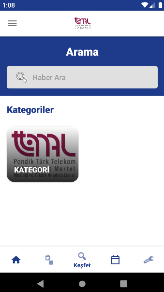
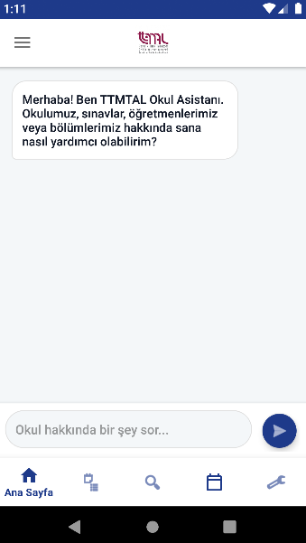
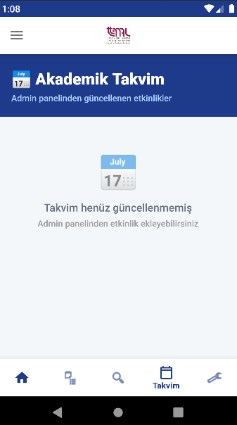
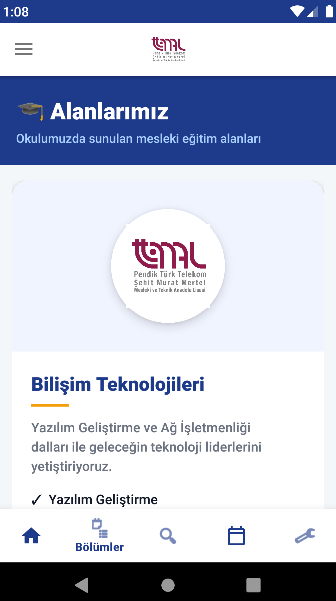
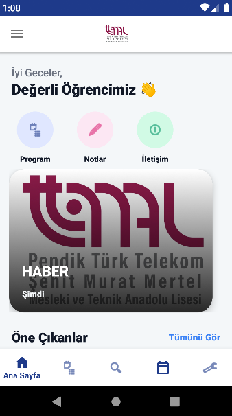
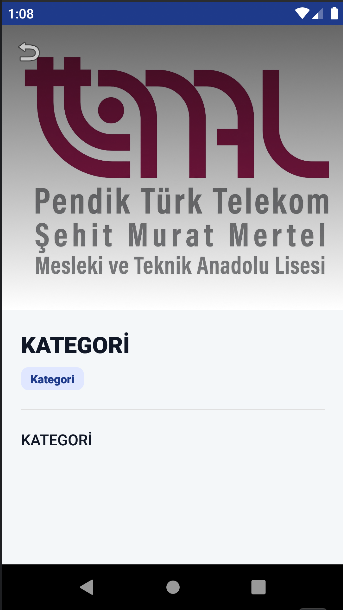
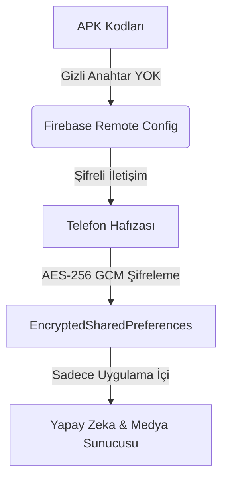

<div align="center">
  
  <h1>📱 TTMTAL Mobil - Ultimate Edition V1.0</h1>
  <p><b>Yapay Zeka Destekli, Askeri Sınıf Şifrelemeye Sahip Kapsamlı Okul Ekosistemi & Yönetim Paneli</b></p>
  
  <a href="https://github.com/AniLLL3734/TTMTAL-Mobil/releases/latest/download/TTMTAL_Mobil_V1.0.apk">
    
  </a>
  <a href="https://anilll3734.github.io/TTMTAL-Mobil/">
    
  </a>
</div>

<br>

<div align="center">
  
  
  
  
  
  
</div>

---

## 📖 Proje Vizyonu
**TTMTAL Mobil**, Pendik Türk Telekom Şehit Murat Mertel Mesleki ve Teknik Anadolu Lisesi için sıfırdan inşa edilmiş, öğrencilerin ve öğretmenlerin dijital dünyadaki buluşma noktasıdır. Sadece bir bilgi ekranı değil; yapay zeka asistanı, dinamik bulut veritabanı ve üst düzey donanımsal şifreleme mimarisiyle donatılmış tam teşekküllü bir **Eğitim Teknolojisi (EdTech)** ürünüdür.

---

## 📸 Arayüz & Deneyim Vitrini

Material Design 3 kurallarına göre tasarlanmış, karanlık mod destekli ve 120Hz akıcılığa göre optimize edilmiş arayüzler.

| Mobil: Ana Sayfa | Mobil: Yapay Zeka Asistanı | Web: Haber & Duyuru Ekleme | Web: Push Bildirim Gönderme |
| :---: | :---: | :---: | :---: |
|  |  |  |  |

| Web: Dashboard | Web: Akademik Takvim Yönetimi | Web: Kategori Düzenleyici | Web: Galeri Albümleri |
| :---: | :---: | :---: | :---: |
|  |  |  |  |

---

## 🚀 Temel Özellikler ve Kullanım Rehberi

### 📱 1. Mobil Uygulama (Öğrenciler ve Veliler İçin)
*   **🤖 Llama 3 Okul Asistanı:** Sağ alttaki chat butonuna basarak RAG (Retrieval-Augmented Generation) mimarisiyle çalışan asistana bağlanın. "Bilişim bölümü nerede?", "Okula hangi otobüs gider?" gibi tüm sorulara okulun kendi veritabanından anında yanıt verir.
*   **📰 Anlık Haber & Duyurular:** `0ms` Firebase senkronizasyonu ile okul idaresinin yayınladığı duyurular saniyesinde ekrana düşer.
*   **🖼️ Akıllı Galeri (ImageKit):** Fotoğraflar sunucuda cihazınızın çözünürlüğüne göre dinamik olarak (%80 tasarruf) sıkıştırılır ve parallax (derinlik) efektiyle listelenir. Tıklandığında Instagram tarzı yatay kaydırmalı (Swipe) tam ekran inceleme sunar.
*   **📅 Akademik Takvim & Notlar:** Yaklaşan etkinlikleri, sınav tarihlerini ve okulun eklediği ders notlarını kategorize edilmiş şekilde bulabilirsiniz.

### 💻 2. Web Yönetim Paneli (Öğretmenler & İdare İçin)
*   [TTMTAL Admin Panel](https://anilll3734.github.io/TTMTAL-Mobil/) adresinden kurumsal mail adresinizle kayıt olun.
*   **Admin Onay Sistemi:** Güvenlik gereği yeni kayıt olan öğretmenler sisteme giremez. Mevcut bir adminin sizi `approvals` menüsünden onaylaması gerekir.
*   **İçerik Yönetimi (CMS):** Sol menüyü kullanarak Haber, Galeri Albümü, Takvim Etkinliği veya Not ekleyebilirsiniz. Eklediğiniz her şey **hiçbir güncelleme gerektirmeden** o saniye öğrencinin telefonunda belirir.
*   **🔔 Push Bildirim Gönderme:** Paneldeki "Bildirim Gönder" sayfasından yazdığınız mesaj, uygulamayı yüklemiş olan binlerce öğrencinin telefonuna anında bildirim (FCM) olarak düşer.

---

## 🛡️ Askeri Sınıf Güvenlik Mimarisi (Zero-Trust)

Projeyi diğer öğrenci projelerinden ayıran en büyük fark güvenlik altyapısıdır:



1.  **Anahtarsız APK:** Kodların içinde `API_KEY` bulunmaz. Groq (Yapay Zeka) ve ImageKit anahtarları uygulamanın ilk açılışında Firebase'den **(Remote Config)** çekilir.
2.  **Donanımsal Şifreleme:** Çekilen anahtarlar, Android'in `Jetpack Security Crypto` kütüphanesi ile cihazın fiziksel güvenlik çipinde (TEE) mühürlenir. Cihaz root'lu olsa dahi bu dosyalara erişilemez.
3.  **Firebase Security Rules:** Web sitesinde görünen Firebase bağlantı anahtarları "sadece kapının adresidir", kilidi açmaz. Veritabanına sadece `Auth` doğrulaması olan yetkili öğretmenler yazabilir/okuyabilir.

---

## ⚙️ Kurulum & Geliştirme (Geliştiriciler İçin)

Kodu kendi projelerinizde kullanmak veya geliştirmek için adımlar:

### 1. Gereksinimler
*   Android Studio Ladybug (veya daha güncel)
*   Java 17 ve Gradle 8.x
*   Bir Firebase hesabı ve bir ImageKit.io hesabı.

### 2. Yapılandırma
1. Repoyu klonlayın: `git clone https://github.com/AniLLL3734/TTMTAL-Mobil.git`
2. `google-services.json` dosyanızı oluşturup `app/` dizinine ekleyin.
3. **Local Build Sırları:** Geliştirme sırasında uygulamanın çökmemesi için `app/src/main/res/values/secrets.xml` oluşturun (Bu dosya repoya gönderilmez):
   ```xml
   <resources>
       <string name="imagekit_public_key">public_...</string>
       <string name="groq_api_key">gsk_...</string>
       <string name="default_web_client_id">GOOGLE_CLIENT_ID_BURAYA</string>
   </resources>
   ```
4. **Firebase Canlı Anahtarları:** Firebase Console -> Realtime Database'e gidin ve ana dizine `remote_config` ekleyip içine şu Key-Value değerlerini ekleyin:
   * `groq_api_key` : (Sizin Groq anahtarınız)
   * `imagekit_public_key` : (Sizin ImageKit Public anahtarınız)
   * `imagekit_url_endpoint` : (https://ik.imagekit.io/...)

### 3. Derleme
Terminal üzerinden: `./gradlew assembleDebug` komutunu çalıştırarak APK çıktınızı alabilirsiniz.

---
<div align="center">
  <b>Geliştirici:</b> <a href="https://github.com/AniLLL3734">AniLLL3734</a> & Antigravity AI
  <br>
  <i>MIT License ile Açık Kaynak Topluluğuna Armağan Edilmiştir</i>
</div>
